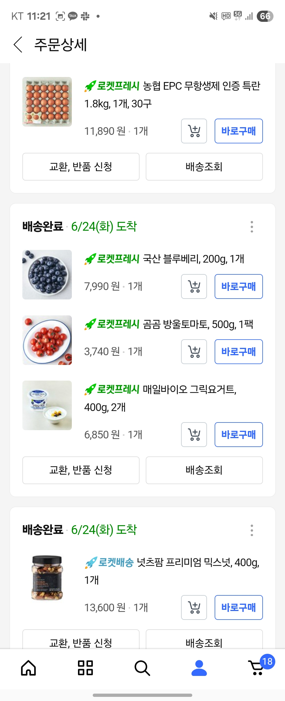
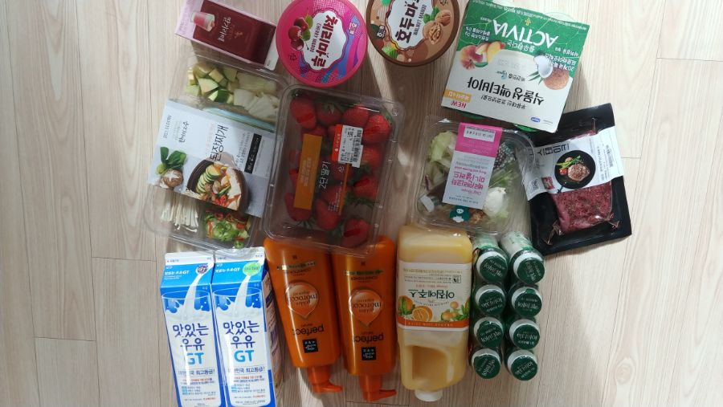
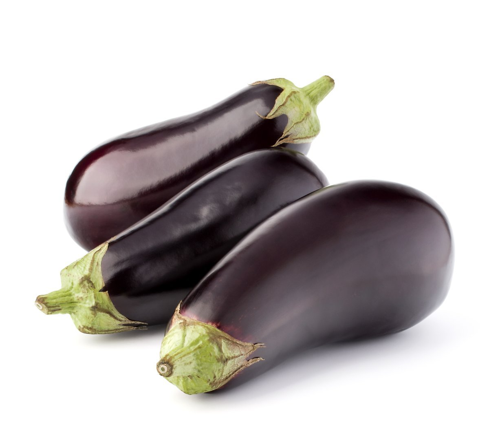

### <2025년 kt ds MS AI 역량 강화 과정 - 파이널 프로젝트>

## 냉장고 식재료 관리 AI 어시스턴트

## 1. 개요
```
냉장고 속 식재료를 효율적으로 관리하고 낭비 없이 사용하도록 도와주는 AI "냉장고를 부탁해!"
```

  🌐 **바로가기**: [https://youranwoo-webapp-250915.azurewebsites.net](https://youranwoo-webapp-250915.azurewebsites.net)

- motive: Amazon Alexa Refrigerator
  
  

## 2. 주요 기능
```
- 장바구니 이미지 분석 기반 식재료 등록
- 식재료 통합 관리 및 모니터링
- 식재료 사용 기록
- 식재료를 활용할 수 있는 레시피 추천
```

## 3. 기술 스택
**[ Python ]**
```
- Web: Streamlit
- LLM: OpenAI
- Data: Pandas
- etc: python-dotenv
```

**[ Azure ]**
```
- Memory: Blob Storage
- Search: Search Service
- Web: Web App
- LLM: AI Foundry (gpt-5/2025-08-07)
```

## 4. 소스 구조

```
msai/
├── streamlit_app.py          # 🚀 메인 애플리케이션 진입점
├── requirements.txt          # 📦 Python 패키지 의존성
├── streamlit.sh             # 🔧 Streamlit 실행 스크립트
├── README.md                # 📖 프로젝트 문서
├── .deployment              # 🌐 Azure 배포 설정
├── .gitignore              # 🚫 Git 무시 파일 목록
│
├── pages/                   # 📱 Streamlit 페이지 모듈
│   ├── __init__.py
│   ├── main_page.py        # 🏠 메인 메뉴 페이지
│   ├── ingredient_registration.py  # 📝 재료 등록 (이미지 분석)
│   ├── ingredient_list.py  # 📋 재료 목록 조회
│   ├── ingredient_usage.py # ✅ 재료 사용 기록
│   ├── recipe_recommendation.py    # 🍽️ 레시피 추천 (Azure AI Search)
│   └── data/
│       └── ingredients_data.csv    # 📊 재료 데이터 (로컬 백업)
│
├── utils/                   # 🔧 공통 유틸리티 모듈
│   ├── __init__.py
│   ├── azure_search_client.py      # 🔍 Azure AI Search 연동
│   ├── blob_storage_manager.py     # ☁️ Azure Blob Storage 관리
│   └── chatgpt_analyzer.py         # 🤖 OpenAI GPT
│
├── crawling/                # 🕷️ 데이터 수집 모듈
│   ├── recipe_crawling.py   # 📡 레시피 데이터 크롤링
│   └── data/
│       └── recipes.csv      # 🍳 수집된 레시피 데이터
│
├── image/                   # 🖼️ 이미지 리소스
    ├── amazon.png          # Amazon 스마트 냉장고 참조 이미지
    └── test*.jpg           # 📸 앱 스크린샷 및 테스트 이미지
```

## 5. LLM 기능 상세

### **LLM Multi-modal**
* prompt
```
    system_prompt = """
    You are the manager of the refrigerator's food inventory.
    Given an image of a shopping cart, you must analyze the image to extract the ingredients.
        1. Extract the ingredients to be stored in the refrigerator.
        2. Extract the quantity of the extracted ingredients. Also extract the unit of measure for counting the quantity.
        3. Select a typical storage period for the ingredients.
    """

    user_prompt = """
    이미지를 분석하여, 냉장고에 보관할 식재료를 아래와 같은 JSON 형식으로 정리해주세요.
    - 예시: 
    {
    "ingredients": [
        {
        "name": "사과",
        "quantity": 3,
        "unit": "개",
        "expiry_days": 14,
        },
        {
        "name": "파프리카", 
        "quantity": 2,
        "unit": "개",
        "expiry_days": 10,
        }
    ]
    }

    재료를 정리할 때는 다음과 같은 조건을 충족하세요. 
    - 재료는 냉장고에 보관할 재료만 추출하세요.
    - name: 한글로 표시하고, 일반적인 표현을 사용하세요. 재료의 색상이나 브랜드 등 상세한 정보는 name에 포함하지 않습니다.
    - expiry_days: 일 단위로 표시하세요.
    - unit: 재료에 대한 일반적인 단위를 사용하세요.
    - quantity: 수량을 표시하세요. 수량은 정수 및 소수점 표시가 가능합니다. 예) 2.5, 3, 4.5, 5 등
            
            """
```
* sample images
  
  
  
  
  
  


### **Document Search**
* .csv 데이터 샘플
```
itle,url,ingredients,steps
정말 맛있는 우삼겹 덮밥 규동 레시피! 간단한 한끼로 딱입니다.,https://www.10000recipe.com/recipe/6966065,우삼겹 250g; 양파 1/4개; 설탕 1큰술; 맛술 1큰술; 올리고당 1큰술; 간장 2큰술; 다진마늘 1큰술,"1. 양파 1/4개는 송송 썰어줍니다 | 2. 양념장을 만들어주세요. 설탕 1큰술, 맛술 1큰술, 올리고당 1큰술, 간장 2큰술, 다진마늘 1큰술 | 3. 팬에 우삼겹 250g을 넣고 먼저 볶아주세요. | 4. 고기가 다 익으면 양파를 넣고 후추 살짝 뿌려 1분간 볶아줍니다. | 5. 양파가 반투명하게 익으면 키친타올로 우삼겹의 기름을 닦아주세요. 기름을 안닦고 요리하면 엄청..느끼해져요! | 6. 양념장을 넣고 2분간 볶아주세요. 고춧가루, 청양고추, 페페론치노 추가해도 좋아요 | 7. 뜨거운 밥 위에 올려서 드시면 됩니다. 계란후라이, 달걀노른자 추가하면 더 좋아요"
```

* Azure AI Search retriever 구현 부분 
```
    results = self.client.search(
        search_text=search_query,
        top=top_k,
        search_mode="any",  # 일부 조건만 만족해도 결과 반환 (점수 낮아도 결과 나옴)
        query_type="simple",  # 단순 쿼리로 변경
        select=["title","url","ingredients","steps"],
        highlight_fields="ingredients",  # searchable 필드만 하이라이트
        order_by=["search.score() desc"]
    )
            
```

## 6. 고도화 방안


#### **사용자 경험 개선**

- **AI 보완 시스템**: LLM이 정확하게 분석하지 못한 부분을 사용자가 직접 수정/보완하는 피드백 기능
- **스마트 알림**: 유통기한 임박 알림, 재료 소진 예측, 최적 소비 시점 추천
- **개인화 서비스**: 사용자 선호도 학습을 통한 맞춤형 레시피 추천

#### **콘텐츠 확장**

- **생활 팁 제공**: 식재료 보관법, 건강한 식재료 조합, 영양소 정보
- **계절별 추천**: 제철 재료 활용 레시피, 계절별 건강 관리 팁

#### **AI 모델**

- **Fine-tuning**: 한국 식재료에 특화된 이미지 분석 모델 학습
- **Multi-modal AI**: 이미지 + 텍스트 + 음성을 통합한 멀티모달 AI 모델 활용

#### **데이터 관리 체계화**

- **DB 활용**: DB 기반 식재료 및 레시피 관련 데이터 관리
