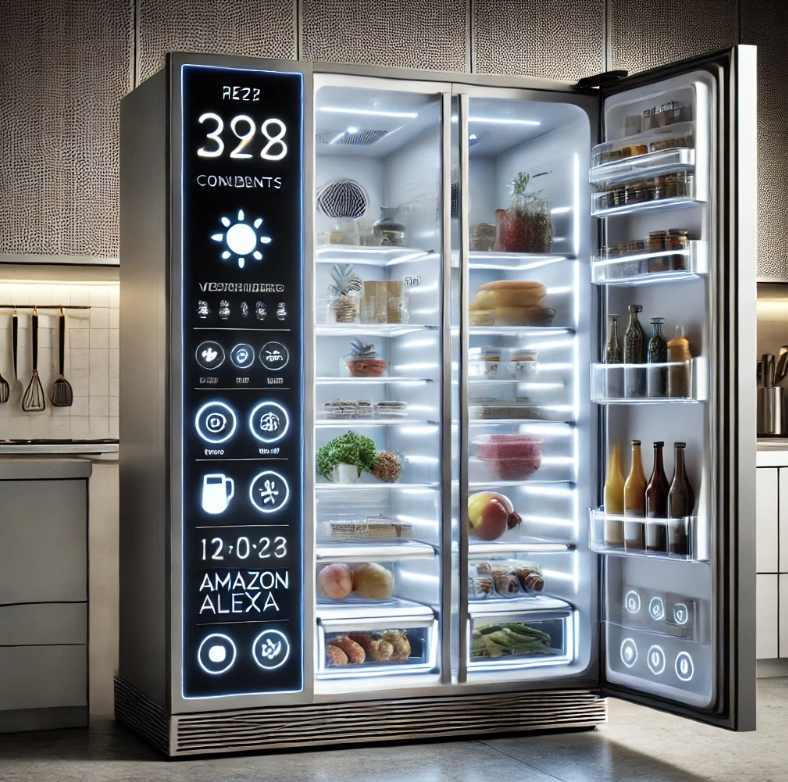

### <2025년 kt ds MS AI 역량 강화 과정 - 파이널 프로젝트>

## 냉장고 식재료 관리 AI 어시스턴트

## 1. 개요
```
냉장고 속 식재료를 효율적으로 관리하고 낭비 없이 사용하도록 도와주는 AI "냉장고를 부탁해!"
```

  🌐 **바로가기**: [https://youranwoo-webapp-250915.azurewebsites.net](https://youranwoo-webapp-250915.azurewebsites.net)

- motive: Amazon Alexa Refrigerator
  
  

## 2. 주요 기능
```
- 장바구니 이미지 분석 기반 식재료 등록
- 식재료 통합 관리 및 모니터링
- 식재료 사용 기록
- 식재료를 활용할 수 있는 레시피 추천
```

## 3. 기술 스택
**[ Python ]**
```
- Web: Streamlit
- LLM: OpenAI
- Data: Pandas
- etc: python-dotenv
```

**[ Azure ]**
```
- Memory: Blob Storage
- Search: Search Service
- Web: Web App
- LLM: AI Foundry (gpt-5/2025-08-07)
```

## 4. 소스 구조

```
msai/
├── streamlit_app.py          # 🚀 메인 애플리케이션 진입점
├── requirements.txt          # 📦 Python 패키지 의존성
├── streamlit.sh             # 🔧 Streamlit 실행 스크립트
├── README.md                # 📖 프로젝트 문서
├── .deployment              # 🌐 Azure 배포 설정
├── .gitignore              # 🚫 Git 무시 파일 목록
│
├── pages/                   # 📱 Streamlit 페이지 모듈
│   ├── __init__.py
│   ├── main_page.py        # 🏠 메인 메뉴 페이지
│   ├── ingredient_registration.py  # 📝 재료 등록 (이미지 분석)
│   ├── ingredient_list.py  # 📋 재료 목록 조회
│   ├── ingredient_usage.py # ✅ 재료 사용 기록
│   ├── recipe_recommendation.py    # 🍽️ 레시피 추천 (Azure AI Search)
│   └── data/
│       └── ingredients_data.csv    # 📊 재료 데이터 (로컬 백업)
│
├── utils/                   # 🔧 공통 유틸리티 모듈
│   ├── __init__.py
│   ├── azure_search_client.py      # 🔍 Azure AI Search 연동
│   ├── blob_storage_manager.py     # ☁️ Azure Blob Storage 관리
│   └── chatgpt_analyzer.py         # 🤖 OpenAI GPT
│
├── crawling/                # 🕷️ 데이터 수집 모듈
│   ├── recipe_crawling.py   # 📡 레시피 데이터 크롤링
│   └── data/
│       └── recipes.csv      # 🍳 수집된 레시피 데이터
│
├── image/                   # 🖼️ 이미지 리소스
    ├── amazon.png          # Amazon 스마트 냉장고 참조 이미지
    └── test*.jpg           # 📸 앱 스크린샷 및 테스트 이미지
```

## 5. 고도화 방안


#### **사용자 경험 개선**

- **AI 보완 시스템**: LLM이 정확하게 분석하지 못한 부분을 사용자가 직접 수정/보완하는 피드백 기능
- **스마트 알림**: 유통기한 임박 알림, 재료 소진 예측, 최적 소비 시점 추천
- **개인화 서비스**: 사용자 선호도 학습을 통한 맞춤형 레시피 추천

#### **콘텐츠 확장**

- **생활 팁 제공**: 식재료 보관법, 건강한 식재료 조합, 영양소 정보
- **계절별 추천**: 제철 재료 활용 레시피, 계절별 건강 관리 팁

#### **AI 모델**

- **Fine-tuning**: 한국 식재료에 특화된 이미지 분석 모델 학습
- **Multi-modal AI**: 이미지 + 텍스트 + 음성을 통합한 멀티모달 AI 모델 활용

#### **데이터 관리 체계화**

- **DB 활용**: DB 기반 식재료 및 레시피 관련 데이터 관리
